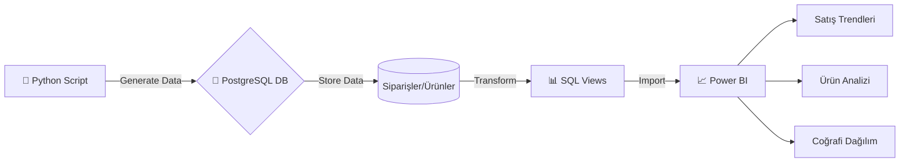

# 📊 E-Ticaret Satış Analizi ve Raporlama Sistemi


**Pendik Belediyesi YETGİM Data Analytics Bootcamp** bitirme projesi kapsamında **Hüseyin Polat** tarafından geliştirilen bu proje; ham veriden anlamlı içgörüler çıkarmayı hedefleyen uçtan uca bir İş Zekası (BI) çözümüdür.

Proje; ilişkisel veritabanı tasarımı (SQL), büyük hacimli veri simülasyonu (Python) ve stratejik karar destek sistemi (Power BI) aşamalarını kapsar.

## 🌟 Temel Özellikler

### 🗄️ Veritabanı Mimarisi (PostgreSQL)
- **İlişkisel Tasarım:** Müşteriler, Ürünler, Siparişler ve Detay tabloları arasında 3. Normal Form'a (3NF) uygun yapı.
- **Performans:** Sipariş sorgularını hızlandırmak için gerekli `INDEX` yapılandırmaları.
- **View Katmanı:** Power BI bağlantısını sadeleştirmek için `vw_Satis_Detay` gibi sanal tablolar.

### 🐍 Veri Simülasyonu (Python Automation)
- **Faker Kütüphanesi:** Gerçekçi Türk isimleri, adresleri ve ürün verileri üretimi.
- **Dinamik Algoritma:** Yıllara ve mevsimselliğe göre dağılan tutarlı tarih ve sipariş verisi.
- **Otomasyon:** Tek tıkla binlerce satırlık verinin veritabanına enjekte edilmesi (`generate_seed.py`).

### 📊 Power BI & DAX Analitiği
- **Time Intelligence:** `TOTALYTD`, `PREVIOUSMONTH` gibi DAX fonksiyonları ile zaman serisi analizleri.
- **KPI Takibi:** Ciro, Aylık Büyüme Oranı (%) ve Ortalama Sepet Tutarı gibi metriklerin dinamik hesaplanması.
- **Gelişmiş Görseller:**
  - 🌍 Coğrafi Satış Haritası
  - 📈 Aylık Ciro ve Trend Analizi (Area Chart)
  - 📦 En Çok Satan Ürünler (Top 10)
  - 🌳 Kategori Kârlılık Haritası (Treemap)

---

## 🏗 Teknik Mimari ve Klasör Yapısı

```text
e_commerce_analysis/
├── schema.sql         # Veritabanı tablo ve ilişki tasarımları
├── views.sql          # Raporlama için özelleştirilmiş SQL görünümleri
├── generate_seed.py   # Python ile rastgele veri üretim senaryosu
├── seed_data.sql      # (Otomatik üretilen) Veritabanı dolgu verileri
├── Satis_Analizi.pbix   # Power BI Proje Dosyası (Dashboard)
└── README.md          # Proje dokümantasyonu
```

## 🔄 Veri Akış Şeması (Workflow)



---

## 💻 Kurulum ve Çalıştırma

**1. Veritabanını Hazırlayın**
PostgreSQL üzerinde ECommerceDB adında bir veritabanı oluşturun ve schema.sql dosyasını çalıştırın.

**2. Verileri Yükleyin**
`seed_data.sql` dosyasını çalıştırarak veritabanını örnek verilerle doldurun. (Alternatif olarak `generate_seed.py` ile taze veri üretebilirsiniz).

**3. Power BI**
Raporunu Açın `Satis_Analizi.pbix` dosyasını açın
**Not:** Veritabanı bağlantı ayarları (Veri Kaynağı Ayarları) sizin yerel PostgreSQL şifrenize göre güncellenmelidir.

---

## 📝 Gereksinim Karşılama Tablosu

| Kriter | Durum | Açıklama |
| --- | --- | --- |
| **SQL Database Design** | ✅ | Primary/Foreign Key'ler ve Constraints tam. |
| **Data Generation** | ✅ | Python ile gerçekçi veri üretimi sağlandı. |
| **Data Visualization** | ✅ | Power BI ile interaktif dashboard. |
| **SQL Views** | ✅ | Veri modelleme SQL tarafında yapıldı. |

---

## 👤 Geliştirici

**Hüseyin Polat**
*İş Zekası & Veri Analitiği Uzmanı Adayı*

* **GitHub:** [hsynpng](https://github.com/hsynpng/)
* **Proje:** [Repo Linki](https://github.com/hsynpng/yetgim-data-analytics-ecommerce-project)
* **Bootcamp:** Pendik Belediyesi YETGİM - Data Analytics Bootcamp
